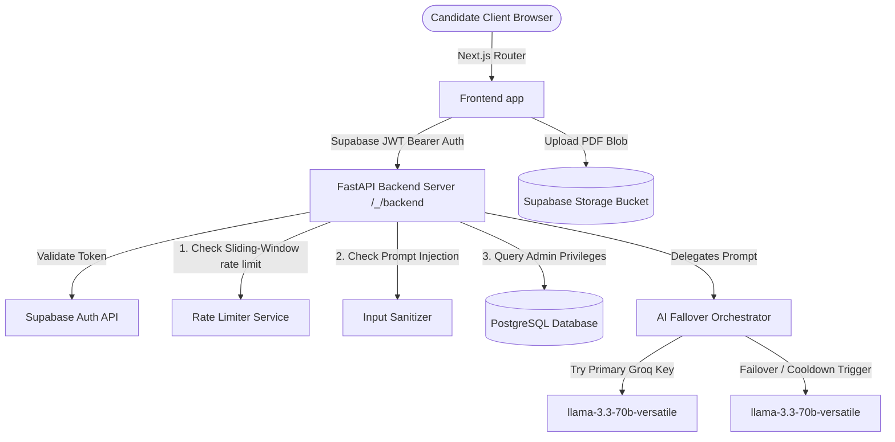

# REZIQ — Premium AI Career Intelligence Platform

### Stop Applying Blind. Get Recruiter-grade Hiring Intelligence Instantly.

**[Live Production URL: https://reziqai.vercel.app](https://reziqai.vercel.app)**

---

## 1. Project Overview & Problem Statement

Most job seekers submit their resumes into a black box, only to be filtered out silently by Applicant Tracking Systems (ATS) or human recruiters before getting a screen.

**REZIQ** resolves this. It is a premium career intelligence operating system that acts as a candidate’s private hiring committee. By uploading their resume and a target job posting, users receive a multi-page forensic analysis mapping ATS compatibility, human recruiter probability, rejection risks, market comparison metrics, high-impact project suggestions, and a comprehensive **21-Day Skill Gap Improvement Roadmap** loaded with direct learning resources.

---

## 2. Platform Architecture

REZIQ is structured as a decoupled monorepo leveraging a hybrid Serverless/Edge network:

```
REZIQ/
├── frontend/             # Next.js 16 (React 19) App Router
│   ├── app/              # Client-side and page layout components
│   ├── src/
│   │   └── lib/          # State stores, Supabase client, and helper files
│   └── public/           # Static SEO assets, sitemap and robots configs
├── backend/              # FastAPI (Python 3.14) API Layer
│   └── app/
│       ├── routers/      # Endpoints (Skill gap, feedback moderation, telemetry)
│       ├── services/     # AI Orchestration, JWT validation, Rate limiting
│       └── main.py       # FastAPI entrypoint, logging, and security headers
├── schema.sql            # Hardened PostgreSQL database schema with RLS
└── vercel.json           # Vercel routing configuration
```

### Production Architecture Flow:


---

## 3. High-Fidelity AI Failover Pipeline

REZIQ is engineered to handle Groq API's low TPM (Tokens Per Minute) ceilings (12,000 TPM limit) while delivering full, untruncated assessments:

1. **Active Swapping**: Transitioned from the decommissioned `deepseek-r1-distill-llama-70b` model to the active `llama-3.3-70b-versatile` model.
2. **Double Groq Key Circuit Breaker**: If the primary Groq API key returns a `429` (Rate Limited) or `413` (TPM limit exceeded), the orchestrator registers a failure, puts the key on a cooldown registry, and automatically routes the request to the secondary Groq key.
3. **Dynamic Token Allocation**: Analyzes the input token count (approx. 7,500 - 8,500 tokens for the resume, job description, and prompt template) and dynamically limits the `max_completion_tokens` to stay under the 12,000 TPM threshold while maintaining a completion target of up to `8192` tokens for maximum report detail.

---

## 4. Production Hardening & Security Features

REZIQ is hardened with enterprise-grade security structures:

### A. Secret Protection
- Hardened `.gitignore` ignores all local environmental variables, caches, build output directories, and secret certificate files.
- Credentials and private keys are injected strictly via Vercel Dashboard environment configurations.

### B. Row Level Security (RLS)
- RLS is enabled on all tables in Supabase (`profiles`, `reports`, `history`, `feedback`, `admin_users`, `ai_usage_logs`).
- Closed public write/insert vectors. Feedback and logging writes are funneled through the FastAPI backend using the `SUPABASE_SERVICE_ROLE_KEY` client.
- Client uploads to `supabase.storage` under `report-pdfs` are restricted strictly to folders matching the authenticated user's ID (`auth.uid()`).

### C. JWT Authentication Guard
- FastAPI routes `/api/skill-gap/analyze`, `/api/feedback/submit`, and `/api/admin/*` mandate a valid Supabase JWT Bearer token in the `Authorization` header.
- Admin endpoints verify the caller against the `admin_users` database table to block unauthorized access.

### D. Sliding Window Rate Limiting
- Thread-safe IP and User rate limiting implemented on the API layer:
  - **AI Analysis**: 5 requests per hour, with a 30-second cooldown between requests.
  - **Feedback Submission**: 5 requests per minute, with a 5-second cooldown.
  - **Admin Actions**: 60 requests per minute.
  - **General Route**: 120 requests per minute.
- Edge-aware IP detection checks `CF-Connecting-IP` and `X-Forwarded-For` to prevent proxy bypasses.

### E. Prompt Injection Sanitization
- Regex-based sanitizers intercept jailbreaks, rule override attempts ("ignore previous instructions"), and prompt extraction commands.
- Sticky-data constraints are appended to the system instructions, instructing the LLM to treat inputs strictly as passive text data.

### F. Security Headers
- Every FastAPI response includes compliance headers:
  - `Strict-Transport-Security: max-age=31536000; includeSubDomains; preload`
  - `X-Frame-Options: DENY`
  - `X-Content-Type-Options: nosniff`
  - `Referrer-Policy: strict-origin-when-cross-origin`
  - `Content-Security-Policy`

---

## 5. Web Performance, SEO & Accessibility (WCAG)

- **SEO Excellence**: Default titles, templates, alternates canonical link configurations, sitemaps, structured `robots.txt` exclusion routes, and dynamic meta-data targeting the live `https://reziqai.vercel.app` domain.
- **Structured Data**: Injects custom JSON-LD `SoftwareApplication` schema for search engines.
- **Image Optimization**: WebP and AVIF next-gen formats.
- **Lazy Loading**: Code splitting applied to heavy modules. `html2pdf.js` is imported dynamically on-demand, reducing initial bundle size by ~200KB.
- **Accessibility Compliance**: WCAG keyboard navigation focus indicators, layout semantic structures, and descriptive ARIA labels (`aria-label="Close navigation drawer"`).

---

## 6. Development Setup

### Backend (FastAPI)
```bash
cd backend
python -m venv venv
venv\Scripts\activate
pip install -r requirements.txt
python app/main.py
```
*Runs locally on http://localhost:8000.*

### Frontend (Next.js)
```bash
cd frontend
npm install
npm run dev
```
*Runs locally on http://localhost:3000.*

---

## 7. Disaster Recovery & Rollback Plan

- **Vercel Instant Rollback**: In case of regression, Vercel allows rolling back deployments instantly via the dashboard to the last working commit.
- **Database Backup**: Supabase automatically schedules daily backups of PostgreSQL schemas and tables.
- **Failover Verification**: Latency metrics, API logs, and fallback actions are continually recorded in the `ai_usage_logs` table and monitored in the Admin Telemetry dashboard.

---

## License
MIT © REZIQ
